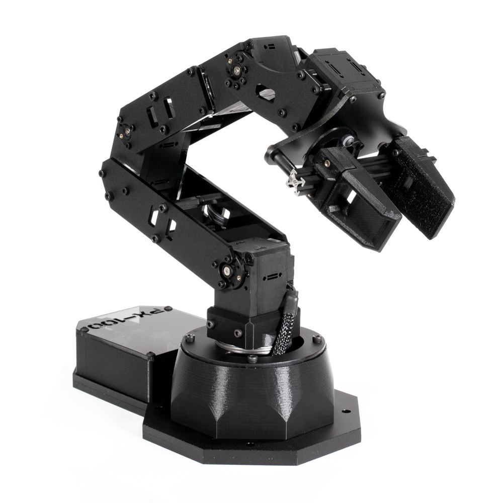

# Fiducial Pick and Place

## Introduction

This project has the Trossen Robotics PX-100 Arm (pictured below) pick
up a cargo, and place it in a drop-off zone. Both the cargo and the
drop-off zone are marked with fiducials. 

### Video

Watch the project in action!

### Hardware

The hardware used for the project is:

1. the PX-100 Arm
