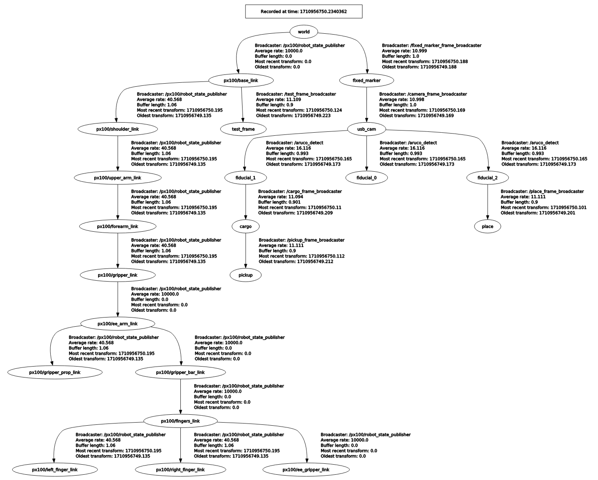
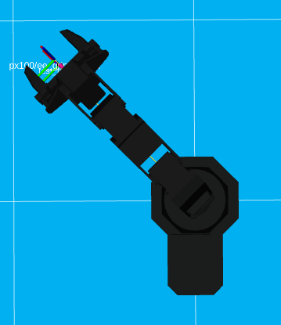
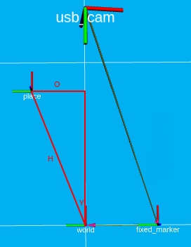

# Fiducial Pick and Place

This project has a robotic arm (the Interbotix PX-100) pick up a cargo,
and place it in a drop-off zone. Both the cargo and the drop-off zone
are marked by, and detected with, fiducials.

---
## Table of Contents
- [Video](#video)
- [What](#what)
    - [Hardware](#hardware)
    - [Software](#software)
- [Why](#why)
- [How](#how)
    - [Overview](#overview)
    - [The TF Tree](#the-tf-tree)
    - [The Vision Solution](#the-vision-solution)
    - [Arm Control](#arm-control)
        - [The Fiducial Setup](#the-fiducial-setup)
        - [The Problem](#the-problem)
        - [Problem Analysis](#problem-analysis)
        - [The Solution](#the-solution)
- [Limitations](#limitations)
---

## Video

[Watch the project in action!](https://drive.google.com/file/d/1LnUodQ4iVPImvU8My7JRYx4RfPqLF8GL/view?usp=drivesdk)

## What

The main features of the project are: 

1. the dynamic detection of the camera's location, obtained by the
   transform from a fixed fiducial to the camera; and
2. the ability of the arm to pickup and place a cargo at varying
   locations, so long as both the cargo's and drop-off zone's fiducials
   are:
    1. detected by the camera (which must also be detecting the
       fixed fiducial mentioned above);
    2. positioned with their x-axes facing away from the arm;
    3. within the arm's reach; and
    4. within a `[90, -90]` degree range, where degree `0` is the
       direction the arm faces in its sleeping position.

Practically speaking, the first feature allows us to adjust the height
and angle of the camera freely, since its relative location to the
other objects (such as the arm and the cargo fiducial) is not
hard-coded.

As for the second feature, see the [Limitations](#limitations) section
on how constraints (ii) and (iv) may be overcome.

### Hardware

Besides a desktop computer, the main hardware used was:

1. the PX-100 robotic arm;
2. a usb camera;
3. three fiducial markers;
4. a camera stand; and
5. a 3D-printed cube.

The hardware setup is pictured below:

    <kbd>
        
    </kbd>

### Software

The source code was written to run on the Noetic-Ninjemys distribution
of ROS, and thus depends on Ubuntu 20.04. The main ROS packages used
were:

1. `tf2` for managing coordinate frames and transforms;
2. `aruco_detect` for fiducial recognition; and
3. `interbotix_xs_modules` for arm manipulation.

Besides the above, the `tf` package was used to convert quaternion
rotations into Euler angles, and the `camera_calibration` package was
used to calibrate the usb camera for fiducial detection. Finally, the
project relied on `numpy` to calculate the distance between the origins
of two coordinate frames.

## Why

This project was developed in the Brandeis Robotics Lab as a teaching
tool. Its aim was to help students of Brandeis' COSI 119A: Autonomous
Robotics learn how to use the PX-100 Arm. 

## How

### Overview

The source code, found in the `src` directory, can be divided into two
groups:

1. tf2 broadcasters: the files whose names terminate in
   `_broadcaster.py` make up this group. Each file publishes a
   coordinate frame and attaches it to the tf tree which, roughly
   speaking, helps the program determine the relative position of some
   physical objects used in the project (the fixed fiducial, the
   camera, the cargo, the drop-off zone, etc.).
2. arm controllers: the two files whose names end in `_controller.py`
   form this group. Of the two, it is the `arm_controller.py` file that
   contains all of the cargo pickup and place logic.

### The TF Tree 

This is what the tf tree of the project looks like:

    <kbd>
        
    </kbd>

The root of the tree is the `world` frame. The subtree that has the
left child of `world` (`px100/base_link`) as its root consists of
frames that help us locate various parts of the PX-100 robotic arm.

On the other hand, the subtree that has the right child of `world`
(`fixed_marker`) as its root are made of frames that constitute our
"vision solution". 

### The Vision Solution

The `fixed_marker` frame is a static frame that is published to be 4.35
inches to the right of the `world` frame. To the right, that is, when
we view the `world` frame from above as pictured in this RViz
screenshot:

    <kbd>
        
    </kbd>

Overlaid with the model of the robot, the image looks like this:

    <kbd>
        
    </kbd>

The fiducial taped to the platform, seen in the hardware setup picture
above, was positioned such that its coordinate frame overlaps as
closely as possible with the `fixed_marker` frame.

Now, the dimensions of every fiducial is known, and our camera
intrinsics have been calibrated via the `camera_calibration` package.
So the `aruco_detect` package can use this information to publish
transforms between the taped fiducial and the usb camera.

But `aruco_detect` by itself doesn't know where the taped fiducial or
the usb camera is located "in the real world". It only knows the
transforms between the fiducial and camera frames, wherever their
absolute positions may be.
 
This is where we can use the `fixed_marker` frame we mentioned above to
"anchor" the coordinate frames of both the fiducial and the camera.

After all, we know where the `fixed_marker` frame is in the real world:
4.35 inches to the starboard side of the center of the base of the
robot.  Further, as mentioned above, we had aligned the taped fiducial
such that its frame overlaps as much as possible with the
`fixed_marker` frame.

So we can take the transform from the taped fiducial to the camera
(provided by `aruco_detect`) and apply its translation and rotation to
the `fixed_marker` frame, to deduce the location of the camera.

This, effectively, is what the `camera_frame_broadcaster.py` file does.
For it publishes a frame for the camera as a child of the
`fixed_marker` frame, using the transform from `fiducial_0` (the taped
fiducial) to `usb_cam`. 

The result is visualized below. Notice how the position of the
`fiducial_0` frame, given by `aruco_detect`, overlaps with that of the
`fixed_marker` frame.

    <kbd>
        
    </kbd>

And this is how we are able to dynamically detect the camera's
location. Since our `fixed_marker` frame serves as the anchor for our
`usb_cam` frame, we can move our usb camera freely and expect our
system to detect it, so long as the camera keeps the taped fiducial
within its field of vision.

### Arm Control

#### The Fiducial Setup

Thus, with our vision solution, the `usb_cam` frame can be successfully
added to the tf tree as a child of the `fixed_marker` frame. And so
long as the camera keeps the taped fiducial (or again, `fiducial_0`) in
view, any other fiducial that it sees with `aruco_detect` would also
have its frame automatically registered as a node of the tf tree.

This is how we see, in our diagram of the tree above, `fiducial_1` and
`fiducial_2` being children of `usb_cam`, where the former is the
fiducial attached to the cargo, and the latter is that representing the
drop-off zone.

The picture that emerges in RViz is as follows:

    <kbd>
        
    </kbd>

#### The Problem

Given this fiducial setup, we might expect picking and placing the
cargo to be fairly simple. For example, the following plan for grabbing
the cargo appears feasible:

1. Take the transform from some component of the arm to the fiducial
   attached to the cargo.
2. Use this transform and the arm's movement API to direct the robot's
   gripper to match its frame with that of the cargo fiducial.
3. Close the gripper.

Unfortunately, the PX-100 has less than 6 degrees of freedom, and so it
cannot position its end-effector's frame to match the pose of any
arbitrary frame within its workspace. So our arm control algorithm must
be slightly more complex, and function within the hardware constraints
of the robot.

#### Problem Analysis 

Fundamentally, the PX-100 can be thought of as a linear gripper fixed
to a potter's wheel. If we want the arm to grab an object, we must
first rotate the wheel by some yaw such that the arm's gripper
directly faces the object. 

In other words, before the arm can grab any object, or even move to
some desired location, we must first turn it on its swivel so that
there is a geometrically straight line between the object and the
middle of the robot's end effector.

This restriction would not pose a problem in the following case.
Suppose that the frame of the target destination is such that its
x-axis lies on some straight line `s`, such that for some yaw `y`, if
we swivel the arm by `y`, its end effector would point to the target
destination via `s`.

Then, we can simply implement the plan we described in [the
problem](#the-problem) section above. That is, we can use some
transform from the arm to the target object to move the arm to the
object.

Indeed, this is what `test_frame_broadcaster.py` and
`test_arm_controller.py` collectively simulate. The former broadcasts a
test frame whose x-axis lies on the straight line visualized in yellow 
below:

    <kbd>
        
    </kbd>

Given that the test frame is positioned as it is, we can directly move
the arm to the frame via transforms. This is what the
`test_arm_controller.py` code does:

    <kbd>
        
    </kbd>

But it is unreasonable to demand of human users of our program that
they manually perfectly align the x-axis of the cargo's fiducial to an
imagined straight line from the center of the robot. Even as a teaching
tool, our project must provide a more practical answer.

#### The Solution

The solution implemented in this project used some basic trigonometry.
We will walk through our strategy for the place logic, since it's
fundamentally the same as that for our pickup logic.

As we already saw, our vision solution allows us to detect the fiducial
that represents the drop-off zone, namely, that with frame
`fiducial_2`:

    <kbd>
        
    </kbd>

The first step, then, is to broadcast another coordinate frame that
shares its origin with that of `fiducial_2`, but whose rotation matches
that of the `world` frame (we will see why later). We will call this
the "place" frame.

    <kbd>
        
    </kbd>

Here's an image of the `fiducial_2` and `place` frames overlapping.

    <kbd>
        
    </kbd>

Now notice that we can draw the following right triangle:

    <kbd>
        
    </kbd>

The letter `Y` represents the yaw, or the angle by which we need to
turn the arm so that its limbs lie along the straight line between the
origin of `world` and that of `place`. And the following is true:

    <code>arcsin(O/H) == Y</code>,

where `H` represents the length of the hypotenuse, and `O` that of the
line opposite `Y`, in our right triangle. 

But we can get `H` by calculating the distance between the origins of
`place` and `world`, while `O` equals the absolute value of the
y-translation from `world` to `place`.

These calculations, then, are what the `arm_controller.py` file
performs when executed. After the results are obtained, all we need to
do is leverage the PX-100's api to:

1. move the arm's waist by yaw `Y`, and its end effector by the
   appropriate distance (by using `H`); and
2. use the z-translation from the world frame to the place frame to
   make the arm descend by the appropriate height.

The result is pictured below:

    <kbd>
        
    </kbd>

Note: in navigating `arm_controller.py`, observe that the px-100's api
manipulates the arm's gripper by using transforms from the
`px100/base_link` frame to the destination frame. This is why we use
the distance `H` to move the gripper to the place frame, though the
distance between the gripper's frame and the place frame is much less
than `H`. 

## Limitations

### Curved Fiducials

The strategy of the pickup logic is similar to that of the place logic
discussed above. However, one limitation of our project is in our
hardware: the fiducials for the drop-off zone and the cargo are not
perfectly flat. This means that the virtual position of the fiducials
as given by `aruco_detect` do not perfectly correspond to their real
positions; they are off by a couple of centimeters.

This offset does not matter much for the drop-off zone, since it does
not prevent the arm from placing the cargo on the white paper area
(which we define to be a successful place). But the offset does prevent
the arm from picking up its cargo successfully.

One solution would be to make flat fiducials. This would be a hardware
fix. But this project's approach was to determine the offset by trial
and error, and publish another `cargo` frame at the determined offset
from `fiducial_1` (the frame of the fiducial attached to the physical
cargo). The result is shown below:

    <kbd>
        
    </kbd>

Next, the project published a `pickup` that shares its origin with the
`cargo` frame, and implemented the trigonometry reasoning discussed
above:

    <kbd>
        
    </kbd>

A limitation to this approach is that the x-axis of the fiducial must be
facing away from the arm's center. This is because our calculation of
the offset cargo frame is dependent on this physical setup.

The best way to overcome this limitation would be to simply physically
make the cargo fiducial flat, perhaps by gluing it onto the cargo box
instead of taping it.

### Angular Constraints

Currently, the arm can only pick and place objects that are within the
9 o'clock to 3 o'clock range, from the viewpoint of the gripper. But
this can be easily extended to the arm's full angular range of motion,
by adapting the trigonometry appropriately.

